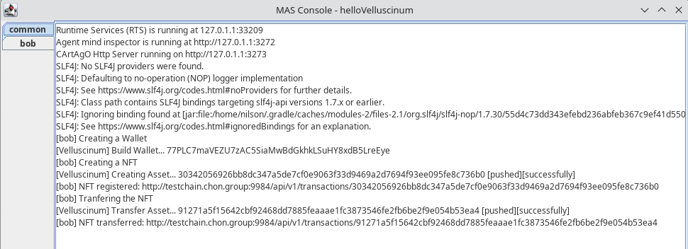
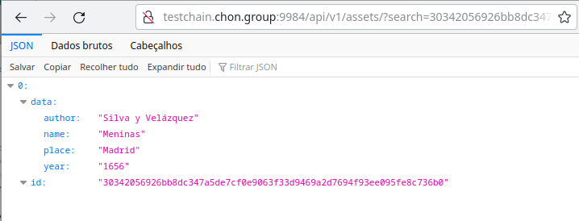
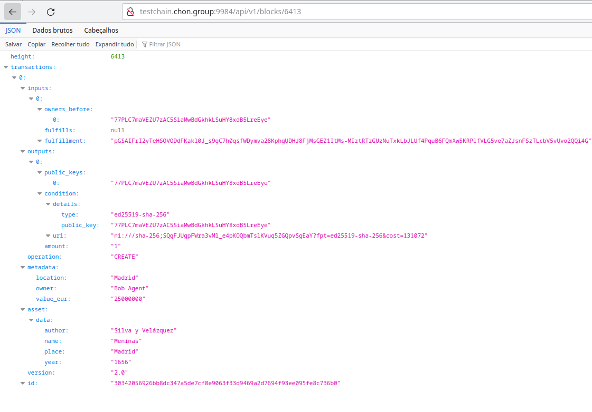
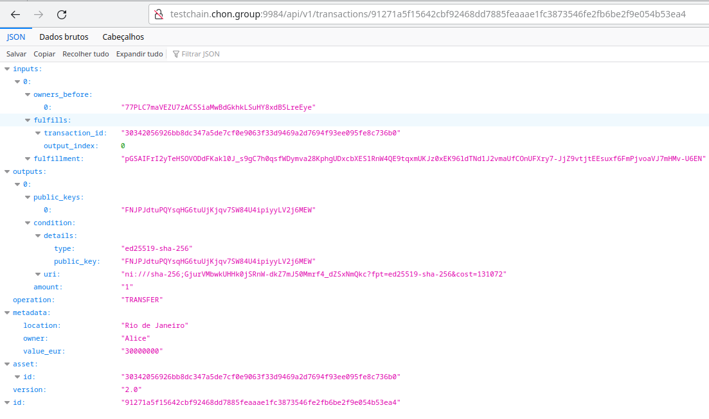
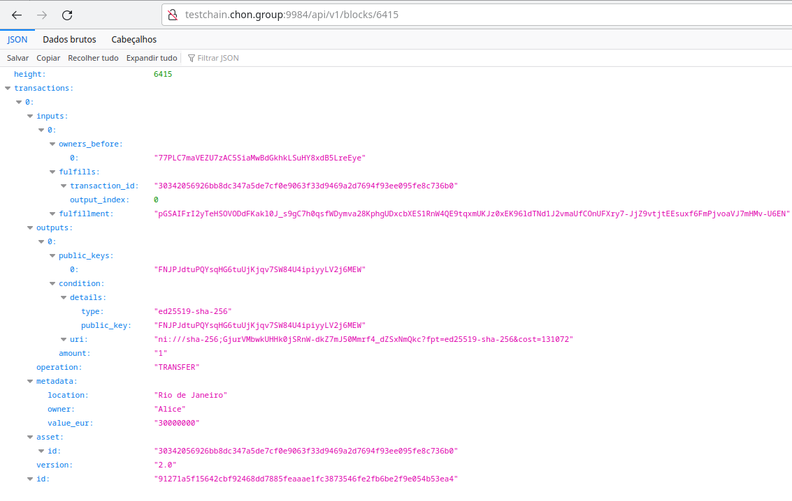

## Hello Velluscinum Example
To install JaCaMo-CLI on your computer, see the [APT Package for JaCaMo CLI](https://github.com/chon-group/dpkg-jacamo)

### Creating a JaCaMo Project
```sh
jacamo app create helloVelluscinum
```

### Configuring Project
Edit  the project file __helloVelluscinum/helloVelluscinum.jcm__
```
mas helloVelluscinum {
    agent bob: sample_agent.asl
    uses package: velluscinum "com.github.chon-group:velluscinum-jcm:0.9-rc"    
}
```

Edit the agent file __helloVelluscinum/src/agt/sample_agent.asl__
```sh
/* Initial beliefs and rules */
bigchainDB("http://testchain.chon.group:9984/").
aliceKey("FNJPJdtuPQYsqHG6tuUjKjqv7SW84U4ipiyyLV2j6MEW").

/* Initial goals */
!start.

/* Plans */
+!start <-
	.print("Creating a Wallet");
	velluscinum.buildWallet(myWallet);
	.wait(myWallet(PrivateKey,PublicKey));
	
	.print("Creating a NFT");
	?bigchainDB(Server);
	velluscinum.deployNFT(Server,
			PrivateKey,PublicKey,
			"name:Meninas;author:Silva y Velázquez;place:Madrid;year:1656",
			"location:Madrid;value_eur:25000000;owner:Bob Agent",
			myNFT);

	.wait(myNFT(AssetID));
	.print("NFT registered: ",Server,"api/v1/transactions/",AssetID);

	.print("Tranfering the NFT");
	?aliceKey(AliceKey);
	velluscinum.transferNFT(Server,
			PrivateKey,PublicKey,
			AssetID,
			AliceKey,
			"value_eur:30000000;owner:Alice;location:Rio de Janeiro",
			transactionTo(alice));
				
	.wait(transactionTo(alice,TransferID));
	.print("NFT transferred: ",Server,"api/v1/transactions/",TransferID);
.
```

### Running JaCaMo
```sh
nilson@pc:~/hello-vellus$ jacamo helloVelluscinum/helloVelluscinum.jcm
```


### Checking
The asset was registered with ID [30342056926bb8dc347a5de7cf0e9063f33d9469a2d7694f93ee095fe8c736b0](
http://testchain.chon.group:9984/api/v1/assets/?search=30342056926bb8dc347a5de7cf0e9063f33d9469a2d7694f93ee095fe8c736b0) as below:


The asset was included in Block [6413](http://testchain.chon.group:9984/api/v1/blocks/6413) as below:


The transfer was registered with ID [91271a5f15642cbf92468dd7885feaaae1fc3873546fe2fb6be2f9e054b53ea4](http://testchain.chon.group:9984/api/v1/transactions/91271a5f15642cbf92468dd7885feaaae1fc3873546fe2fb6be2f9e054b53ea4) as below:


The transfer was included in Block [6415](http://testchain.chon.group:9984/api/v1/blocks/6415) as below:
