## The Chef and the Glutton

### Creating a JaCaMo Project
```sh
jacamo app create chefBankGlutton
```

### Configuring Project
Edit  the project file __helloVelluscinum/helloVelluscinum.jcm__ as below:
```
mas chefBankGlutton {
  agent bank
  agent chef
  agent glutton
  uses package: velluscinum "com.github.chon-group:velluscinum-jcm:0.9-rc"
}
```

Create the file __chefBankGlutton/src/agt/bank.asl__ with the content of [agent bank file](chefBankGlutton/src/agt/bank.asl)
<details>
<summary>Agent bank content file</summary>

```
// Agent bank in project chefBankGlutton
/* Initial beliefs and rules */
chainServer("http://testchain.chon.group:9984/").

/* Initial goals */
!createCoin.

/* Plans */
+!createCoin
:chainServer(Server) <-
    .print("Creating digital wallet");
    velluscinum.buildWallet(myWallet);
    .wait(myWallet(PrK,PuK));

    .print("Creating and sharing a cryptocurrency");
    velluscinum.deployToken(Server,PrK,PuK,"name:ChainCoin",200,chainCoin);
    .wait(chainCoin(Coin));
    .broadcast(tell,cryptocurrency(Coin));
    .broadcast(tell,bankWallet(PuK));
    .broadcast(tell,chainServer(Server));
.
    
+!lending(ResquestNumber,ClientWallet,Value)[source(Client)]
: chainCoin(Coin) 
& myWallet(Prk,PuB) 
& chainServer(Server) <-
    .print("Hello Agent ",Client,", Wellcome to BanChain! - Please wait while we check the transaction.");
    velluscinum.stampTransaction(Server,Prk,PuB,ResquestNumber,loan(Client));
    velluscinum.transferToken(Server,Prk,PuB,Coin,ClientWallet,Value,transactionTransfer);
    .send(Client,tell,bankAccount(ok)).
```
</details>

Create the file __chefBankGlutton/src/agt/chef.asl__ with the content of [agent chef file](chefBankGlutton/src/agt/chef.asl)
<details>
<summary>Agent chef content file</summary>

```
// Agent chef in project chefBankGlutton
/* Initial beliefs and rules */
lastOrder(0).

/* Initial goals */
!createWallet.

/* Plans */
+!createWallet <-
	.print("Creating a digital wallet!");
	velluscinum.buildWallet(myWallet);
	.wait(myWallet(Priv,Pub));
	+chefWallet(Pub).

+!order(Product,Qtd,Payment)[source(Client)]: cryptocurrency(Coin) 
			& chainServer(Server) & myWallet(MyPriv,MyPub) <-
	?lastOrder(N);
	OrderNr=N+1;
	-+lastOrder(OrderNr);
	.print("Received the order",OrderNr," ckecking payment...");
	velluscinum.stampTransaction(Server,MyPriv,MyPub,Payment,payment(OrderNr));
	+preparingOrder;
	!cooking(OrderNr,Product,Qtd,Client);
	-preparingOrder.

+!cooking(OrderNr,Product,Qtd,Client) <-
	.print("Preparing order Nr ",OrderNr);
	.wait(1000);
	.send(Client,tell,delivering(Product,Qtd)).
```
</details>

Create the file __chefBankGlutton/src/agt/glutton.asl__ with the content of [agent glutton file](chefBankGlutton/src/agt/glutton.asl)
<details>
<summary>Agent glutton content file</summary>

```
// Agent glutton in project chefBankGlutton
/* Initial beliefs and rules */
foodStock(10).
energy(0).

/* Initial goals */
!enjoy.

/* Plans */
+!requestLend: cryptocurrency(Coin) & bankWallet(BankW) & chainServer(Server) & myWallet(MyPriv,MyPub)<-
	.print("Requesting Lend");
	velluscinum.deployNFT(Server,MyPriv,MyPub,
				"name:comilao;address:5362fe5e-aaf1-43e6-9643-7ab094836ff4",
				"description:Createing Bank Account",
				account);
				
	.wait(account(AssetID));
	velluscinum.transferNFT(Server,MyPriv,MyPub,AssetID,BankW,
				 "description:requesting lend;value_chainCoin:10",requestID);
	.wait(requestID(PP));
	
	.print("Lend Contract nr:",PP);
	.send(bank,achieve,lending(PP,MyPub,10)).
	
+!eat: hungry & foodStock(C) & C>3 & energy(E) & E<=10 <-
	-+foodStock(C-3);
	-+energy(E+3);
	.print("Eating........ [Fridge=",C-3,"] [Energy=",E+3,"]");
	.wait(1000);
	!eat.
	
+!eat: energy(E) & E>10	<-
	.print("Satisfied...... [Energy=",E,"]");
	-hungry;
	!enjoy.

+!eat <-
	?foodStock(X);
	.print("I need food..... [Fridge=",X,"]");
	.wait(1000);
	!orderFood.

+!enjoy: energy(E) & E>5 <-
	.print("Enjoying....");
	.wait(1000);
	-+energy(E-3);
	-hungry;
	!enjoy.

+!enjoy: energy(E) & E<=5<-
	.print("Tired..... [Energy=",E,"]");
	+hungry;
	!eat.

+!orderFood: bankAccount(ok)[source(bank)] & cryptocurrency(Coin) 
			& chainServer(Server) & myWallet(MyPriv,MyPub) 
			& chefWallet(Chef)<-
			
	.print("Ordering food.....");
	velluscinum.transferToken(Server,MyPriv,MyPub,Coin,Chef,5,payment);
	.wait(payment(Transfer));
	.send(chef,achieve,order(pizza,5,Transfer));
	.wait(5000);
	!eat.

+!orderFood: not bankAccount(ok)[source(bank)] <-
	.wait(5000);
	velluscinum.buildWallet(myWallet);
	!requestLend;
	.wait(5000);
	.send(chef,askOne,chefWallet(Chef),Reply);
	+Reply;
	!orderFood.
	
-!orderFood: cryptocurrency(Coin) & chainServer(Server) 
		& myWallet(MyPriv,MyPub) <-
		velluscinum.tokenBalance(Server,MyPriv,MyPub,Coin,balance).	

+delivering(Product,Qtd)[source(Chef)] <-
	?foodStock(X);
	-+foodStock(X+Qtd);
	.print("Wow! Pizza!!!!");
	-delivering(Product,Qtd)[source(Chef)].
	
+balance(T,V)[source(self)]: cryptocurrency(Coin)[source(bank)] & V<5 & Coin==T <-
	.drop_desire(enjoy);
	.print("I don't have money! :(");
	.wait(5000).
```
</details>

### Runing

```sh
jacamo chefBankGlutton/chefBankGlutton.jcm
```
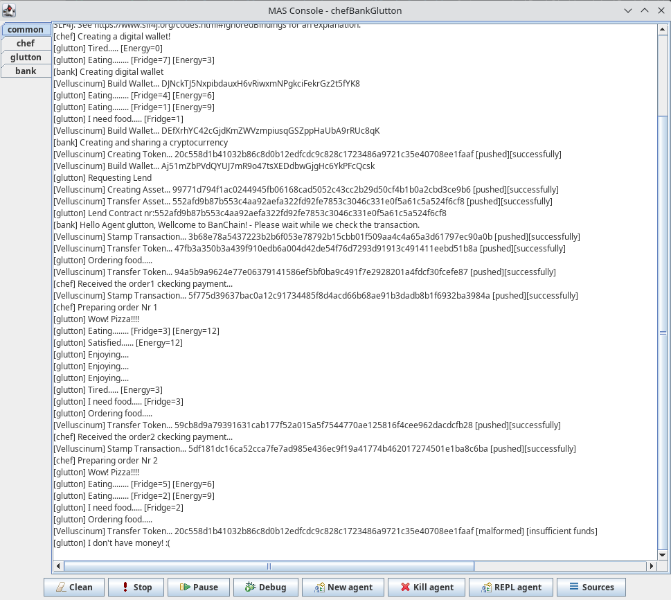

### Checking
#### 1 - Bank creating cryptocurrency
The asset was registered with ID [20c558d1b41032b86c8d0b12edfcdc9c828c1723486a9721c35e40708ee1faaf](http://testchain.chon.group:9984/api/v1/assets/?search=20c558d1b41032b86c8d0b12edfcdc9c828c1723486a9721c35e40708ee1faaf) as below:
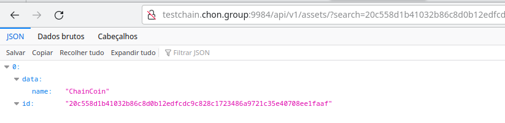

The asset was included in Block [6453](http://testchain.chon.group:9984/api/v1/blocks/6453) as below:
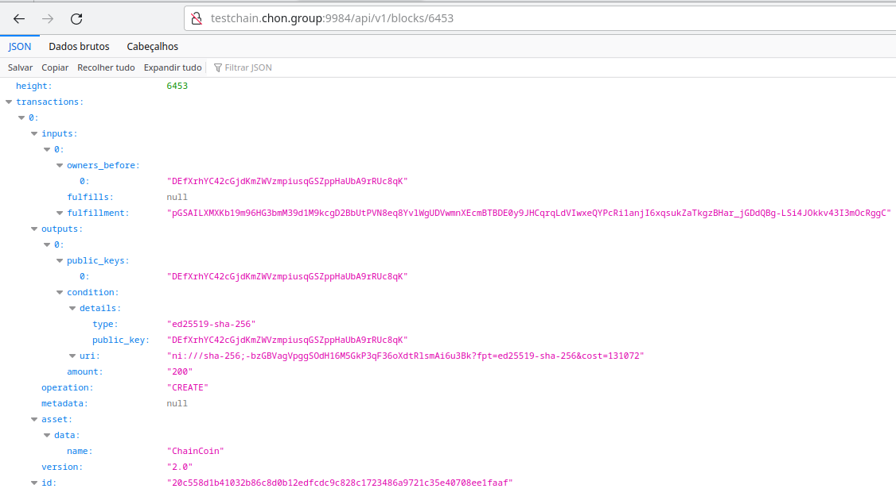

#### 2 - Glutton creating a bank lend agreement
The payment promise was registered with ID [99771d794f1ac0244945fb06168cad5052c43cc2b29d50cf4b1b0a2cbd3ce9b6](http://testchain.chon.group:9984/api/v1/assets/?search=99771d794f1ac0244945fb06168cad5052c43cc2b29d50cf4b1b0a2cbd3ce9b6) as below:
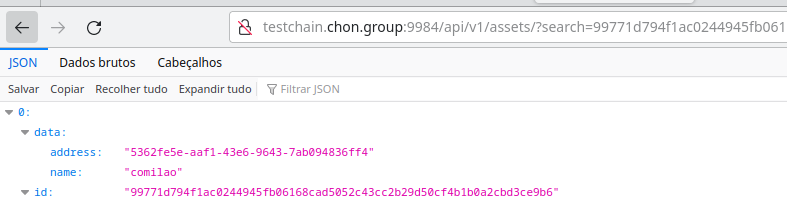

The payment promise was included in Block [6455](http://testchain.chon.group:9984/api/v1/blocks/6455) as below:
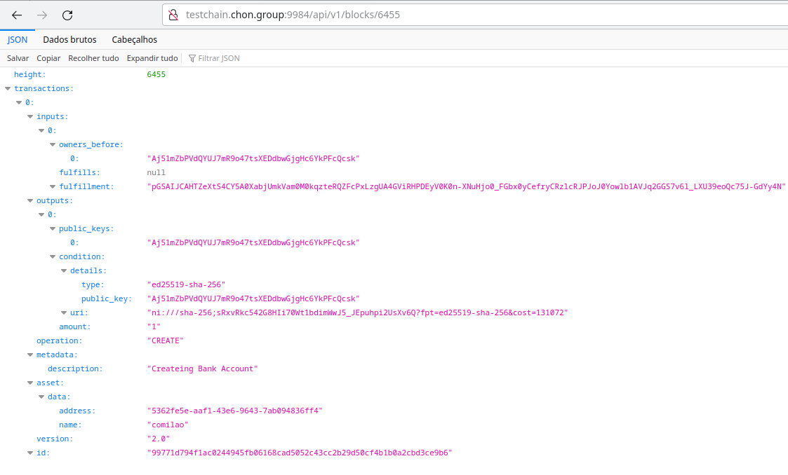

The payment promise was transfered to agent bank in Block [6457](http://testchain.chon.group:9984/api/v1/blocks/6457) as below:
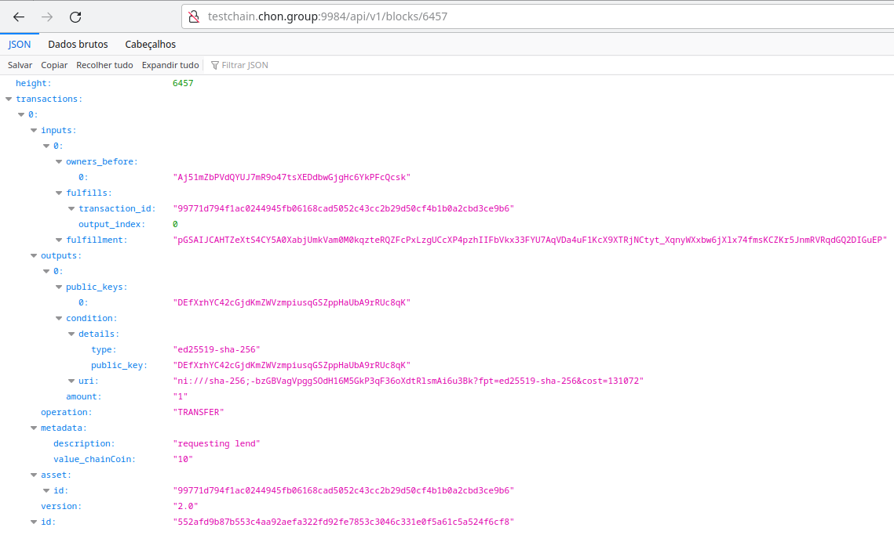

#### 3 - Agent bank [stamping](#stamp-transaction-definition) the payment promisse
The payment promise was [stamped](#stamp-transaction-definition) by agent bank in Block [6459](http://testchain.chon.group:9984/api/v1/blocks/6459) as below:
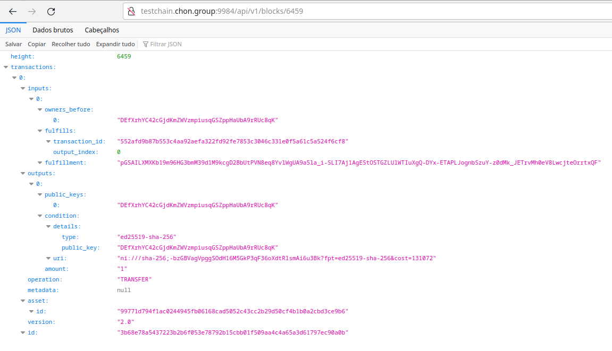

The agent bank transfer 10 units of _ChainCoin_ to glutton wallet in Block [6461](http://testchain.chon.group:9984/api/v1/blocks/6461) as below:
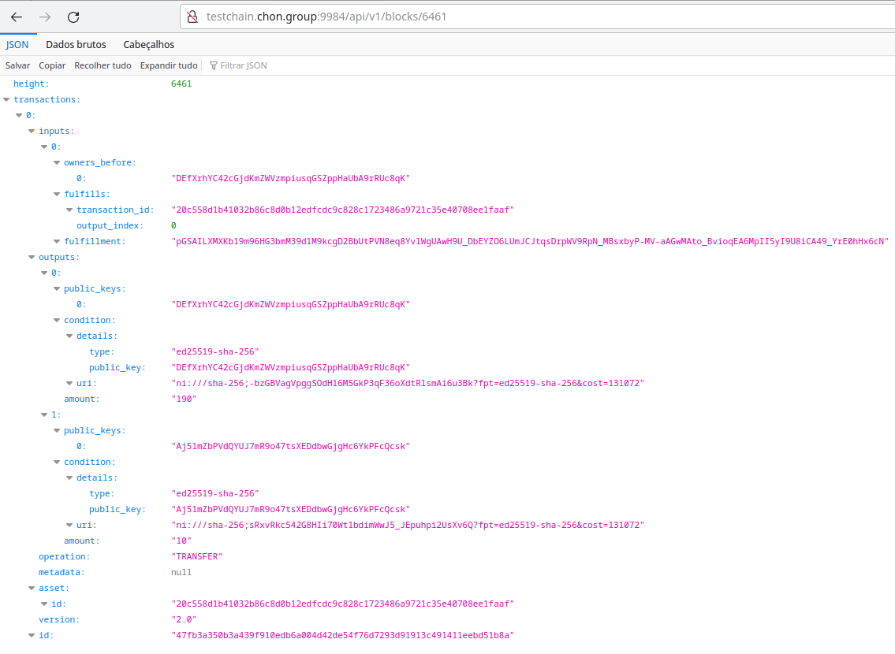

#### 4 - Agent glutton transfering cryptocurrency to agent chef (order nr 1)
The agent glutton transfer 5 units of _ChainCoin_ to chef wallet in Block [6463](http://testchain.chon.group:9984/api/v1/blocks/6463) as below:
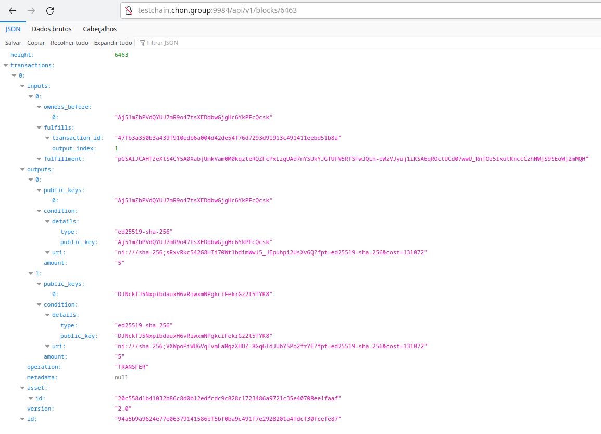

The agent chef [stamp](#stamp-transaction-definition) the transfer in Block [6465](http://testchain.chon.group:9984/api/v1/blocks/6465) as below:
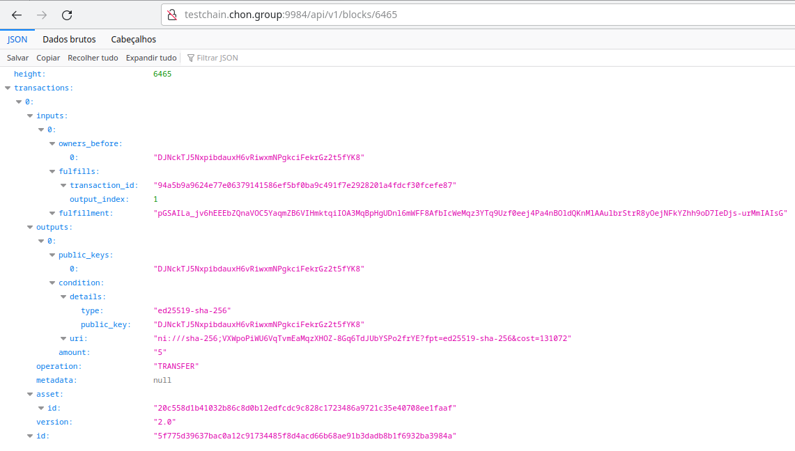

#### 5 - Agent glutton transfering cryptocurrency to agent chef (order nr 2)
The agent glutton transfer 5 units of _ChainCoin_ to chef wallet in Block [6467](http://testchain.chon.group:9984/api/v1/blocks/6467) as below:


The agent chef [stamp](#stamp-transaction-definition) the transfer in Block [6469](http://testchain.chon.group:9984/api/v1/blocks/6469) as below:
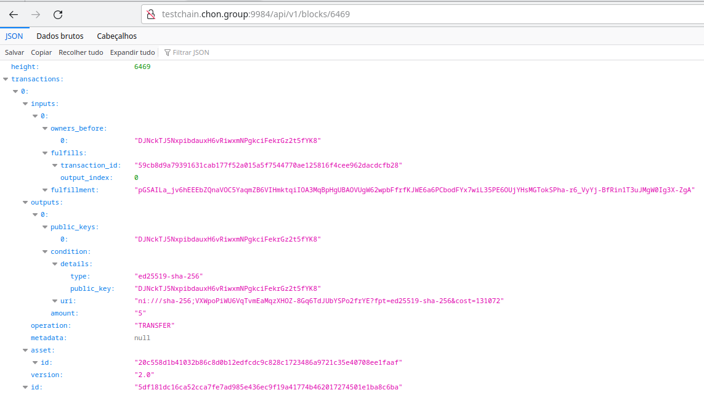

### Balance
Using the [Velluscinum-CLI](https://github.com/chon-group/velluscinum/releases/download/0.9-rc/velluscinum.jar) we can verify the balance of agents wallets.

- The agent bank has the glutton promisse asset and 190 chainCoins;
- The agent glutton have anything in your wallet;
- The agent chef has 20 chainCoins.

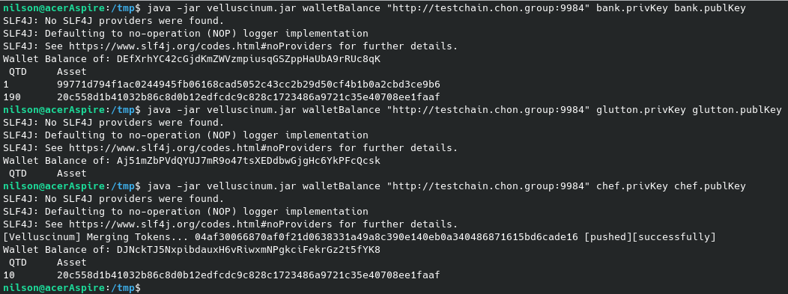

## Stamp Transaction definition
_"Stamping a transaction is a self-transfer and unification process. Self-transfer, therefore, the units received from a divisible asset are transferred to itself, spending the received transaction (filling the OUTPUT pointer with the address of its wallet). Unification because this process joins the units from the received transaction with those already in the wallet. A transaction with two or more INPUT pointers and a single OUTPUT pointer is generated in this process"_. 

See more at: [10.1007/978-3-031-37616-0_17](https://www.researchgate.net/publication/372282299_Velluscinum_A_Middleware_for_Using_Digital_Assets_in_Multi-agent_Systems)