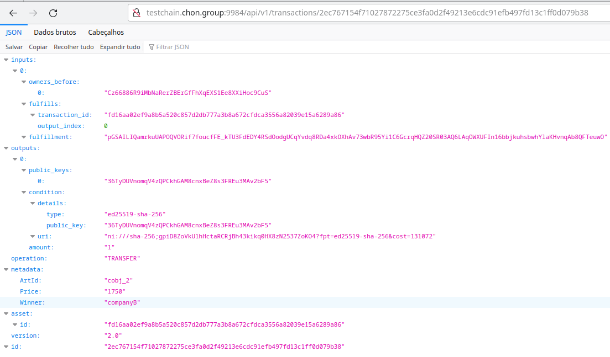
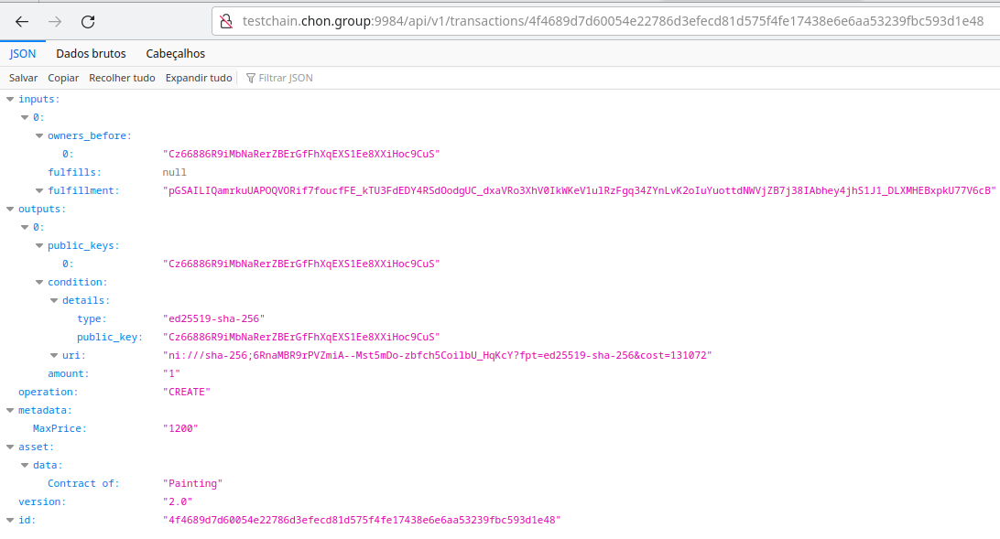
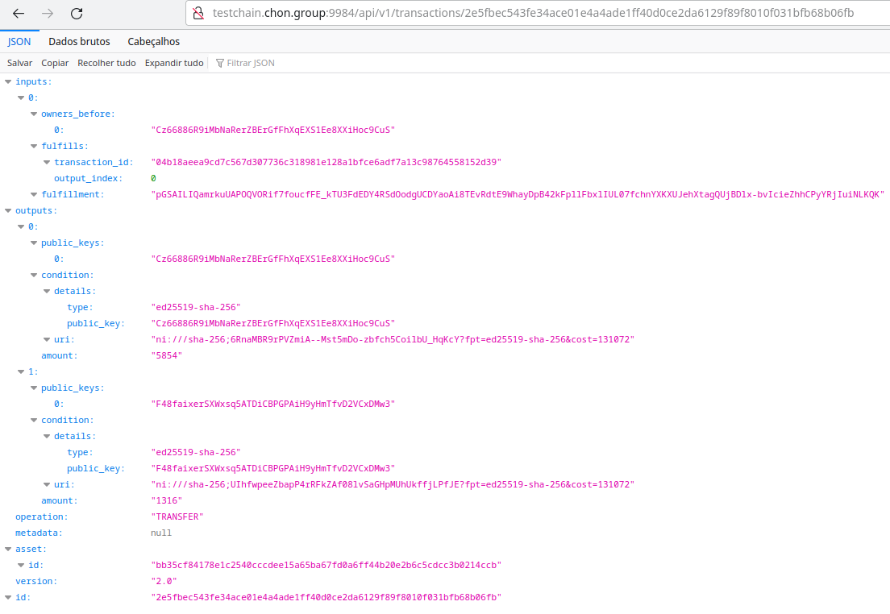

## Building a House
To install JaCaMo-CLI on your computer, see the [APT Package for JaCaMo CLI](https://github.com/chon-group/dpkg-jacamo)

### Importing and running the JaCaMo Project
```sh
cd /tmp/
git clone https://github.com/chon-group/velluscinum-jcm.git
```

### Creating cryptocurrency with [Velluscinum-CLI](https://github.com/chon-group/velluscinum)
```sh
cd /tmp/velluscinum-jcm/examples/03-house-building/
./createCoin.sh 
```


### Running Project

```sh
cd /tmp/velluscinum-jcm/examples/03-house-building/
jacamo houseBuilding/house_building.jcm
```


### Cheking

<details>
<summary> CompanyA </summary>

- Wallet Address: C6AmXTHPHQuqHTYMKj6KWujY1SFFQzhQKxS7JVz3x8qV
- Winner of: Plumbing

<details>
<summary> Plumbing </summary>

#### Auction and execution of the plumbing service:

<details>
<summary> 1 - Giacomo deploys an NFT such as promise or agreement that represents the auction contract for the _Plumbing_ build step. </summary>


</details>
<details>
<summary> 2 - After the bids, giacomo transfers the NFT to winner. </summary>


</details>
<details>
<summary> 3 - After the construction, giacomo tranfers some units of the criptocurrency to company wallet. </summary>


</details>
<details>
<summary> 4 - The company stamps the transaction. </summary>


</details>
<details>
<summary> 5 - Finally, the company return the NFT like a payment voucher. </summary>


</details>
</details>

Using the [Velluscinum-CLI](https://github.com/chon-group/velluscinum/releases/download/24.2.9/velluscinum.jar) we can verify the balance of companyA wallet.


</details>

<details>
<summary> CompanyB </summary>

- Wallet Address: 36TyDUVnomqV4zQPCkhGAM8cnxBeZ8s3FREu3MAv2bF5
- Winner of: SitePreparation

<details>
<summary> SitePreparation </summary>

#### Auction and execution of the site preparation service:

<details>
<summary> 1 - Giacomo deploys an NFT such as promise or agreement that represents the auction contract for the SitePreparation build step. </summary>


</details>
<details>
<summary> 2 - After the bids, giacomo transfers the NFT to winner. </summary>



</details>
<details>
<summary> 3 - After the construction, giacomo tranfers some units of the criptocurrency to company wallet. </summary>


</details>
<details>
<summary> 4 - The company stamps the transaction. </summary>


</details>
<details>
<summary> 5 - Finally, the company return the NFT like a payment voucher. </summary>


</details>
</details>

Using the [Velluscinum-CLI](https://github.com/chon-group/velluscinum/releases/download/24.2.9/velluscinum.jar) we can verify the balance of companyB wallet.


</details>

<details>
<summary> CompanyC5 </summary>

- Wallet Address: BPNfCJCQj756FXm2JhmnkispsvQV1X2NbpouPhfFswTV
- Winner of: Painting and ElectricalSystem

<details>
<summary> Painting </summary>

#### Auction and execution of the painting service:

<details>
<summary> 1 - Giacomo deploys an NFT such as promise or agreement that represents the auction contract for the Painting build step. </summary>



</details>
<details>
<summary> 2 - After the bids, giacomo transfers the NFT to winner. </summary>


</details>
<details>
<summary> 3 - After the construction, giacomo tranfers some units of the criptocurrency to company wallet. </summary>


</details>
<details>
<summary> 4 - The company stamps the transaction. </summary>


</details>
<details>
<summary> 5 - Finally, the company return the NFT like a payment voucher. </summary>


</details>
</details>

<details>
<summary> ElectricalSystem </summary>

#### Auction and execution of the electrical system service:

<details>
<summary> 1 - Giacomo deploys an NFT such as promise or agreement that represents the auction contract for the ElectricalSystem build step. </summary>


</details>
<details>
<summary> 2 - After the bids, giacomo transfers the NFT to winner. </summary>


</details>
<details>
<summary> 3 - After the construction, giacomo tranfers some units of the criptocurrency to company wallet. </summary>


</details>
<details>
<summary> 4 - The company stamps the transaction. </summary>


</details>
<details>
<summary> 5 - Finally, the company return the NFT like a payment voucher. </summary>


</details>
</details>

Using the [Velluscinum-CLI](https://github.com/chon-group/velluscinum/releases/download/24.2.9/velluscinum.jar) we can verify the balance of companyC5 wallets.


</details>

<details>
<summary> CompanyD11 </summary>

- Wallet Address: F48faixerSXWxsq5ATDiCBPGPAiH9yHmTfvD2VCxDMw3
- Winner of: WindowsDoors

<details>
<summary> WindowsDoors </summary>

#### Auction and execution of the windows and doors service:

<details>
<summary> 1 - Giacomo deploys an NFT such as promise or agreement that represents the auction contract for the WindowsDoors build step. </summary>


</details>
<details>
<summary> 2 - After the bids, giacomo transfers the NFT to winner. </summary>


</details>
<details>
<summary> 3 - After the construction, giacomo tranfers some units of the criptocurrency to company wallet. </summary>



</details>
<details>
<summary> 4 - The company stamps the transaction. </summary>


</details>
<details>
<summary> 5 - Finally, the company return the NFT like a payment voucher. </summary>


</details>
</details>

Using the [Velluscinum-CLI](https://github.com/chon-group/velluscinum/releases/download/24.2.9/velluscinum.jar) we can verify the balance of companyD11 wallet.


</details>


<details>
<summary> CompanyE </summary>

- Wallet Address: 3BGz5JPnyFWbTVieP9uM43HtPEnxLH5Wmhq9eNr3aCXb
- Winner of: Floors, Roof, and Walls

<details>
<summary> Floors </summary>

#### Auction and execution of the floors service:

<details>
<summary> 1 - Giacomo deploys an NFT such as promise or agreement that represents the auction contract for the Floors build step. </summary>


</details>
<details>
<summary> 2 - After the bids, giacomo transfers the NFT to winner. </summary>


</details>
<details>
<summary> 3 - After the construction, giacomo tranfers some units of the criptocurrency to company wallet. </summary>


</details>
<details>
<summary> 4 - The company stamps the transaction. </summary>


</details>
<details>
<summary> 5 - Finally, the company return the NFT like a payment voucher. </summary>


</details>
</details>

<details>
<summary> Roof </summary>

#### Auction and execution of the painting service:

<details>
<summary> 1 - Giacomo deploys an NFT such as promise or agreement that represents the auction contract for the Roof build step. </summary>


</details>
<details>
<summary> 2 - After the bids, giacomo transfers the NFT to winner. </summary>


</details>
<details>
<summary> 3 - After the construction, giacomo tranfers some units of the criptocurrency to company wallet. </summary>


</details>
<details>
<summary> 4 - The company stamps the transaction. </summary>


</details>
<details>
<summary> 5 - Finally, the company return the NFT like a payment voucher. </summary>


</details>
</details>

<details>
<summary> Walls </summary>

#### Auction and execution of the painting service:

<details>
<summary> 1 - Giacomo deploys an NFT such as promise or agreement that represents the auction contract for the Walls build step. </summary>


</details>
<details>
<summary> 2 - After the bids, giacomo transfers the NFT to winner. </summary>


</details>
<details>
<summary> 3 - After the construction, giacomo tranfers some units of the criptocurrency to company wallet. </summary>


</details>
<details>
<summary> 4 - The company stamps the transaction. </summary>


</details>
<details>
<summary> 5 - Finally, the company return the NFT like a payment voucher. </summary>


</details>
</details>


Using the [Velluscinum-CLI](https://github.com/chon-group/velluscinum/releases/download/24.2.9/velluscinum.jar) we can verify the balance of companyE wallet.


</details>

#### Giacomo Wallet
Using the [Velluscinum-CLI](https://github.com/chon-group/velluscinum/releases/download/24.2.9/velluscinum.jar) we can verify the balance of giacomo wallet.


## Stamp Transaction definition
_"Stamping a transaction is a self-transfer and unification process. Self-transfer, therefore, the units received from a divisible asset are transferred to itself, spending the received transaction (filling the OUTPUT pointer with the address of its wallet). Unification because this process joins the units from the received transaction with those already in the wallet. A transaction with two or more INPUT pointers and a single OUTPUT pointer is generated in this process"_. 

See more at: [10.1007/978-3-031-37616-0_17](https://www.researchgate.net/publication/372282299_Velluscinum_A_Middleware_for_Using_Digital_Assets_in_Multi-agent_Systems)